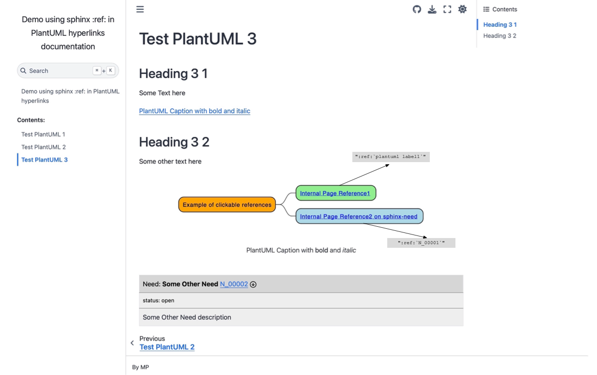

# Demo using sphinx std:ref: in PlantUML hyperlinks

The demo shows PlantUML scripts using sphinx :ref: to be resolved as Sphinx postprocessing step after the documentation build finished.

    .. uml::
        :caption: PlantUML Caption with **bold** and *italic*
        :name: PlantUML Label2
    
        @startmindmap mindmap2
    
        *[#Orange] Example of clickable references
        **[#lightgreen] [[ ":ref:`plantuml label1`" Internal Page Reference1 ]]
        **[#lightblue] [[ ":ref:`N_00001`" Internal Page Reference2 on Sphinx-Needs ]]

        @endmindmap
